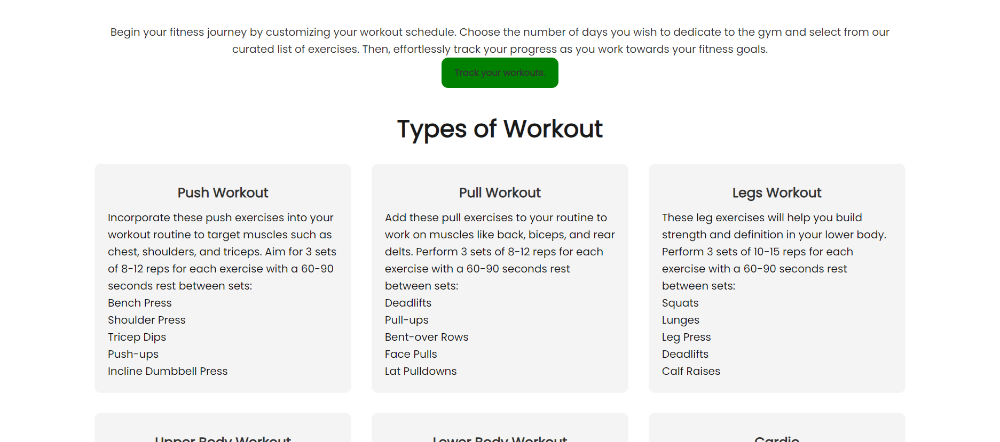

# Home Workout

Visit the site deployed on github: [GymWorkout](https://slucaci.github.io/JavaScriptProject/index.html)

Welcome to GymTracker App! GymTracker is offering a way to track your workouts and elevate your fitness journey.

## CONTENTS

- [User Experience](#user-experience-ux)

  - [User Stories](#user-stories)

- [Design](#design)

  - [Colour Scheme](#colour-scheme)
  - [Typography](#typography)
  - [Imagery](#imagery)
  - [Wireframes](#wireframes)
  - [Features](#features)
    - [The Home Page](#the-home-page)
    - [The ContactUs Page](#the-contactus-page)
    - [The Program](#the-program-page)
    - [The Plans Page](#the-plan-page)
    - [Future Implementations](#future-implementations)
  - [Accessibility](#accessibility)

- [Technologies Used](#technologies-used)

  - [Languages Used](#languages-used)
  - [Frameworks, Libraries & Programs Used](#frameworks-libraries--programs-used)

- [Deployment & Local Development](#deployment--local-development)

  - [Deployment](#deployment)
  - [Local Development](#local-development)
    - [How to Fork](#how-to-fork)
    - [How to Clone](#how-to-clone)

- [Testing](#testing)
- [Credits](#credits)

  - [Code Used](#code-used)
  - [Content](#content)
  - [Media](#media)
  - [Acknowledgments](#acknowledgments)

  ## User Experience (UX)

  ### User Stories

  #### First time visiting the site

  - As a first-time visitor, I aim to find workout plans, track the progress and rest time in between sets.

  #### Freaquent Visitor

  - I want to see my progress thru the app, see if I will do better in the gym compared to last time

## Design

### Colour Scheme

I have used the following colors:

| Colour         | Hex                                                              |
| -------------- | ---------------------------------------------------------------- |
| Example Colour |  #0a192f |
| Example Colour |  #024bc0 |
| Example Colour |  #f4f4f6 |
| Example Colour |  #000000 |
| Example Colour |  #008000 |
| Example Colour |  #FF0000 |

### Typography

I have used google fonts library to import the fonts on my website and the main font on site is "Poppins", followed by "sans-serif" .

I laso used "font-awesome" library, for icons like instagram, x, tiktok, menu icons etc.

### Imagery

I selected a background image with dumbbells reflecting strength and vitality, inspiring users' fitness journeys with its dynamic and empowering visuals.

### Wireframes

Wireframes were created for mobile and desktop using Balsamiq.

### Features

Explore the GymWorkout website with 4 pages, where you can select what type of workout you would like and the track your journey.

All Pages on the website are responsive and have:

1. A logo, when pressed will return you to the home page
2. A Nav Bar, which will change when using on a mobile device.

- This is the desktop version of the nav bar.

  

- This is the mobile version of the nav bar.

  

- On the mobile version, I have used javascript functions to hide the nav bar when the "x" icon is pressed, and pop the pages when the "navigation" icon is pressed.

### The Home Page

The home page has a "Get Started" button, which is very important for the website, when pressed, this button will bring visitors on the Plans page. The user then needs to select what types of workout wants to do and then track them using the Program Page.

### The ContactUs Page

The Contact Us Page has three things, a form where people ask questions, a map and contact details.

I've implemented form submission and data collection seamlessly using the Web3Forms API endpoint at https://web3forms.com/ where I receive an email at serjlucaci@gmail.com when the user completes the form, and a message will be displayed.

Also there's a Go back button witch redirects the user back to the Contact Us Page.

### The Program Page

On the Program Page the user can add multiple workouts. The user is able to update, delete track the rest in between sets as can be seen in the following video.

### The Plans Page

The Plans Page has 6 types of workout. The user can choose whatever he wants to do in the gym, then press the "Track your workouts" button to redirect him on the Program page.

### Future Implementations

#### I would like to add on my website the following things:

    - Multiple exercises for each workout day, with a video explained.
    - Progress Analytics: Where a user can see a grafic displayed to help him understand their performance.

### Accessibility

1. Alt Text for images

- All images used on this website has an alt text, providing users with screen readers and those with visual impairments with information about the content and purpose of the images.

2. Semantic HTML

3. Hover on all buttons so people know they're about to click on something, also, on this website, the button changes the colour when the mouse is on it.

4. Form Accesibility

- Form on this project inculude appropiate labes and placeholder text.

## Technologies Used

#### Languages Used

HTML, CSS and JavaScript.

#### Frameworks, Libraries & Programs Used

- [README Editor](https://readme.so/editor) - to write the code for readme file
- [ Visual Studio](https://code.visualstudio.com/) - to write the HTML/CSS/JS code

- [ Prettier](https://marketplace.visualstudio.com/items?itemName=esbenp.prettier-vscode) - a VSCode Extension to format the code

- [Balsamiq](https://balsamiq.com/) - for the wireframes.

- [Canva](https://www.canva.com/) - for resizing the images.

- [Cloud Convert](https://cloudconvert.com/webp-converter) - to convert the images into the webp format

- [Github](https://github.com/) - to manage the website
- [Veed.io](https://www.veed.io/tools/video-editor?utm_id=16880413186&utm_term=&utm_campaign=x_Search_PerfomanceMax_Youtube&utm_source=google&utm_medium=cpc&utm_content=_&hsa_acc=2332311570&hsa_cam=16880413186&hsa_grp=&hsa_ad=&hsa_src=x&hsa_tgt=&hsa_kw=&hsa_mt=&hsa_net=adwords&hsa_ver=3&gad_source=1&gclid=Cj0KCQjw-r-vBhC-ARIsAGgUO2Als1m0YkUgTA882xt2ChBn1a8RzUud-a-EYwbdCFy-ZG-zM8QHrwEaAkQXEALw_wcB) - to edit the videos.

- [Google Fonts](https://fonts.google.com/)

- [Developer Tools](https://developer.chrome.com/docs/devtools) - to arrange the items on the page, to view the pages on different formats

## Deployment & Local Development

### Deployment

The site is deployed using GitHub Pages on - [GymWorkout](https://slucaci.github.io/JavaScriptProject/index.html)

Steps to deploy on github pages:

1. Login to your Github Account
2. Go to: [slucaci/HTMLCSS](https://slucaci.github.io/JavaScriptProject/index.html).
3. Click the settings button in the middle top of the page
4. Select pages in the left hand side
5. Select main branch and press save.
6. The site is deployed and live using github.

### Local Development

#### How to Fork

To fork the repository:

1. Login to your Github Account.
2. Go to: [slucaci/HTMLCSS](https://slucaci.github.io/JavaScriptProject/index.html)
3. Click the Fork button in the top right corner.

#### How to Clone

To clone the repository:

1. Login to your Github Account.
2. Go to: [slucaci/HTMLCSS](https://slucaci.github.io/JavaScriptProject/index.html)
3. On the repository's main page, find the green "Code" button located towards the right side of the page.
4. Copy the URL provided in the textbox.
5. Type 'git clone' into the terminal and then paste the link you copied in step 4. Press enter.

## Testing

Check the [TESTING.md](TESTING.md) file for a detailed summary of all testing procedures conducted.

## Credits

### Code used

I utilized various YouTube channels to deepen my understanding of HTML and CSS and JavaScript. Special thanks to the following channels:

1. [SuperSimpleDev](https://www.youtube.com/@SuperSimpleDev)
2. [Bro Code](https://www.youtube.com/@BroCodez)
3. [tuv](https://www.youtube.com/@tutvid)
4. [JavaScript Mastery](https://www.youtube.com/@javascriptmastery)
5. [dcode](https://www.youtube.com/@dcode-software)

[StackOverflow](https://stackoverflow.com/) I have checked StackOverflow to check bugs and errors which matched mine

I have used [kera-cudmore](https://github.com/kera-cudmore/readme-examples) template to write the README file.

### Content

- Logo was created using Canva Pro.
- My website features six distinct types of workouts, as identified through Google search.

### Media

The backgroud image was downloaded from google from the following [link](https://stock.adobe.com/images/Sports-dumbbells/59678374?as_campaign=TinEye&as_content=tineye_match&clickref=1101lyrtUcHh&mv=affiliate&mv2=pz&as_camptype=backlink&as_channel=affiliate&as_source=partnerize&as_campaign=tineye).

The logo was created by myself using Canva Pro.

### Acknowledgments

- Graeme Taylor - Code Institute Mentor

- The Slack channel from Code Institute was where I found useful answers regarding my problems during the project.

- Code Institute Course
