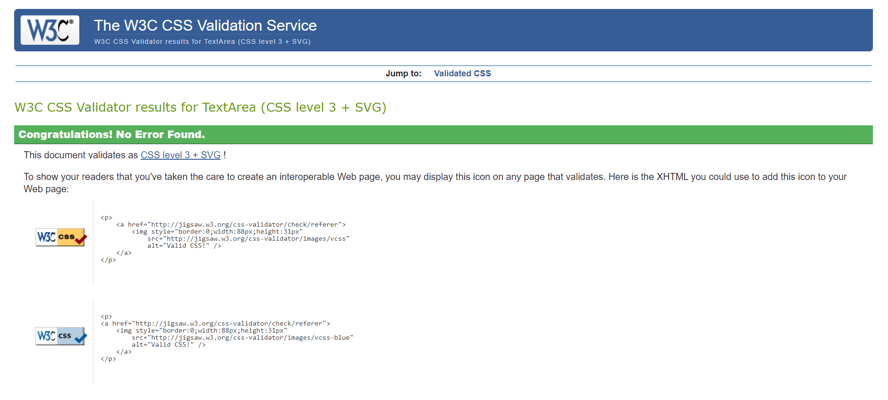
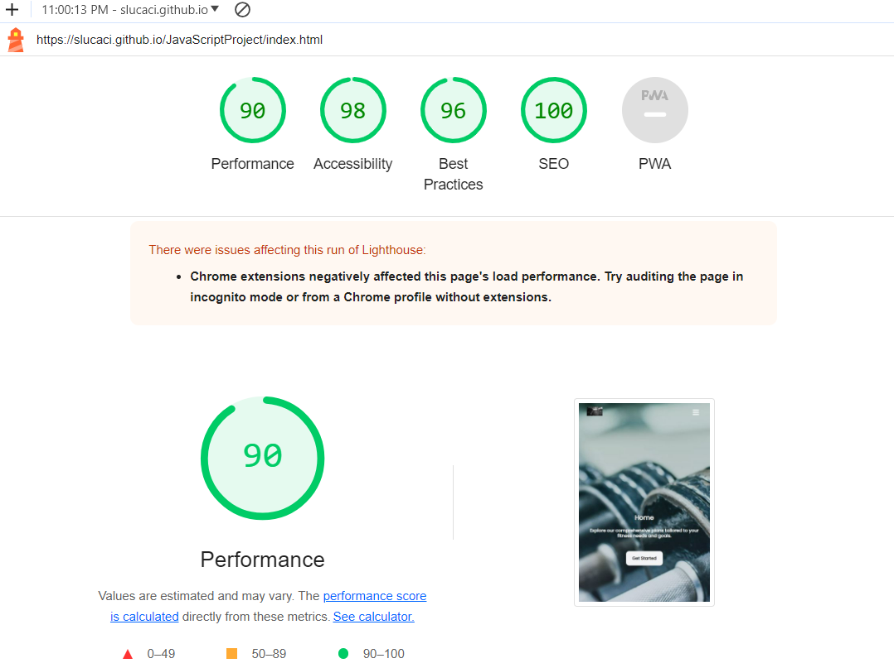

# Home Workout

Visit the site deployed on github: [HomeWorkout](https://slucaci.github.io/HTMLCSS/index.html)

## CONTENTS

- [AUTOMATED TESTING](#AUTOMATED-TESTING)

  - [W3C Validator](#W3C-Validator)

  - [Snyk](#Snyk)

  - [Lighthouse](#Lighthouse)

- [MANUAL TESTING](#MANUAL-TESTING)

  - [Testing User Stories](#Testing-User-Stories)

## AUTOMATED TESTING

### W3C Validator

[HTML W3C](https://validator.w3.org/) was used to validate the HTML code.

- [Home Page](https://slucaci.github.io/JavaScriptProject/index.html) - 0 errors
  
- [Contact Us Page](https://slucaci.github.io/JavaScriptProject/contactus.html) - 0 erros
  
- [Program Page](https://slucaci.github.io/JavaScriptProject/Program.html) - 0 errors
  
- [Plans Page](https://slucaci.github.io/JavaScriptProject/Plans.html) - 0 errors
  

[Snyk](https://snyk.io/?utm_medium=paid-search&utm_source=google&utm_campaign=gs_sn:-brand-ecpc&utm_content=br_security&utm_term=snyk%20security&gad_source=1&gclid=CjwKCAjwuJ2xBhA3EiwAMVjkVCG4ohrnfZjWF26h9InZOuezFv6VamTSrVI1iSfdaqvijOheOX2svRoC5ssQAvD_BwE) to validate JS Code - 0 errors

[ CSS W3C](https://jigsaw.w3.org/css-validator/) was used to validate the CSS code.

### LightHouse

I have used developer tools Lighthouse to do tests on my website pages on mobile and desktop version.

#### Desktop Version

#### Mobile Version

## Manual Testing

#### Navigation Test:

1. Click on each navigation link (Home, Contact Us, Program, Plans) in the header navigation bar.
2. Verify that each link redirects to the corresponding page without any errors.
3. Ensure that the active link is visually distinguished from the other links.

#### Responsive Design:

- Objective: Test the website's responsiveness across different devices and screen sizes.
- Steps:

1. Open the website on a desktop/laptop computer with a standard screen size.
2. Resize the browser window to simulate smaller screen sizes (tablet, mobile).
3. Check if the website layout adjusts accordingly, ensuring readability and usability on all devices.
   Test any interactive elements to ensure they function properly on different devices.

#### Footer Icons Test

1. Verify that the social media icons in the footer are clickable.
2. Click on each social media icon (X, TikTok, Instagram) and confirm that it opens the respective social media profile in a new tab/window.

#### Form Test

1. Find the form on "Contact Us" Page
2. Try to press the submit button with 1 empty field
3. Form will not send because all the fields are mandatory

#### Links test

1. Check if all links function corectly and make sure they open in a new tab when clicked
2. Check if all links work effectively on different devices
